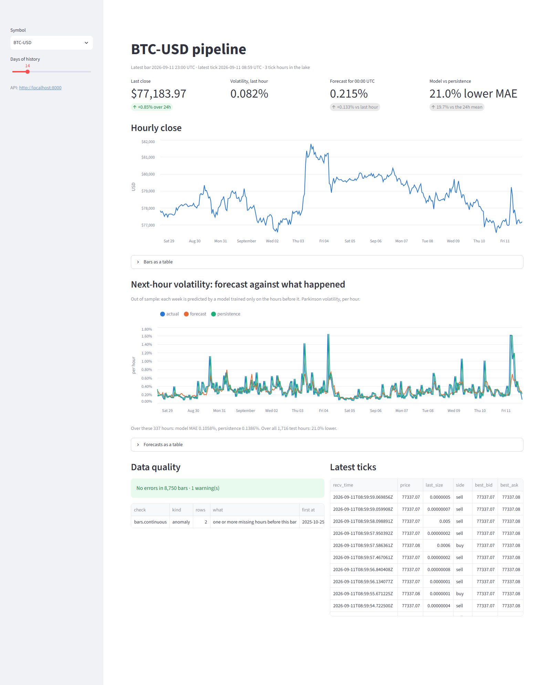
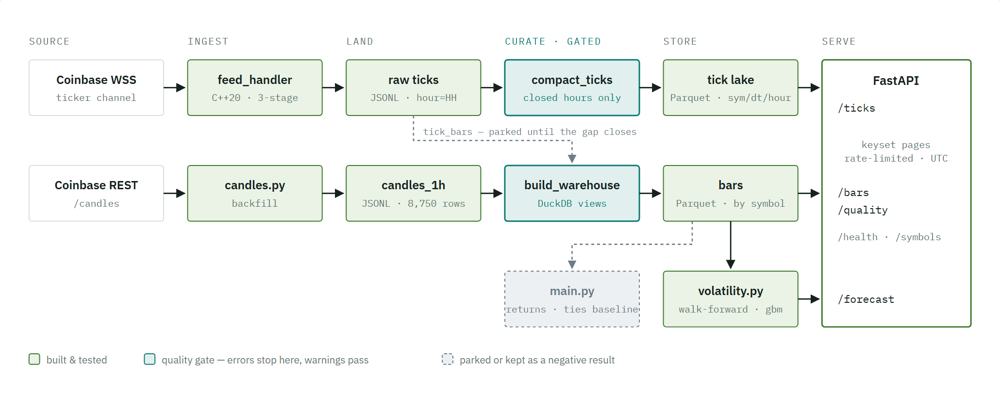
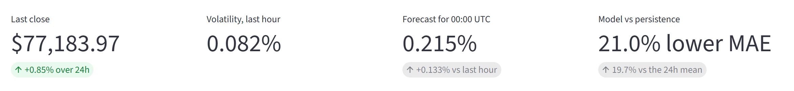
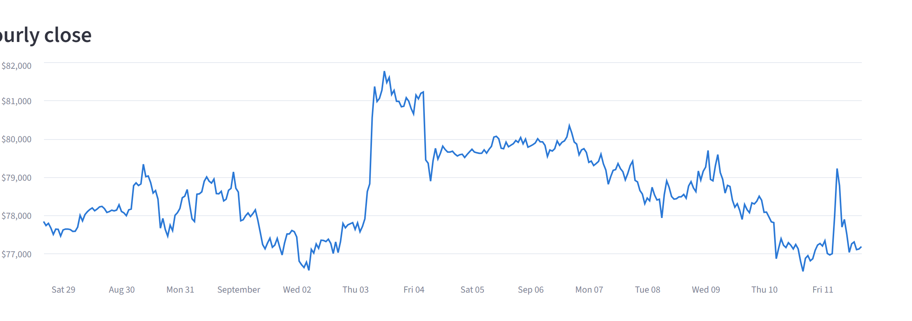
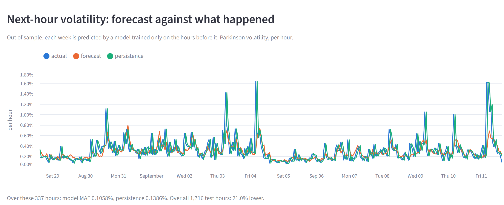
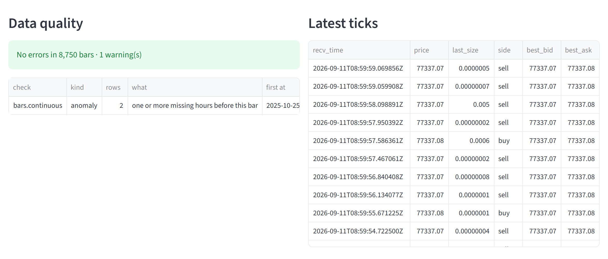

# crypto-ml-pipeline

A market-data pipeline for Coinbase BTC-USD: a multithreaded C++20 feed handler, a
partitioned Parquet lake with quality gates, a DuckDB warehouse, a FastAPI query service,
a Kafka (Redpanda) streaming path, and a walk-forward volatility forecast.

Every number below was measured in this repo, and each one sits next to the control that
makes it mean something. A zero-loss result is only evidence if the same load loses data
under a policy that allows it. A quiet race detector is only evidence if it catches a
planted race.

<picture>
  <source media="(prefers-color-scheme: dark)" srcset="img/dashboard-dark.png">
  
</picture>

*The dashboard (`services/dashboard/`), reading everything through the API -- it never opens a
Parquet file itself. Captured 2026-09-11 with bars and ticks current; these screenshots follow
your GitHub theme, light and dark both taken from the running app.*

## How it fits together

<picture>
  <source media="(prefers-color-scheme: dark)" srcset="img/architecture-dark.png">
  
</picture>

Nothing calls anything: every connection is a file, a view or a topic, so any piece rebuilds
without touching the others. The two teal boxes are the quality gates, where bad data stops --
a closed hour with an error-level finding is held back from the lake, and a `bars` export with
one never replaces the Parquet the model reads.

## Results

| Claim | Measured | How, and the control |
|---|---|---|
| Lock-free SPSC ring, parser pool, cache-line padding, benchmarked against Python | best C++ 149,854 frames/s vs Python 135,526 | 129,601 recorded frames replayed unpaced. The honest finding: `nlohmann::json` is the bottleneck, not the queue ([feed-handler README](../services/feed-handler/README.md#benchmarks)) |
| Race-free under ThreadSanitizer | 6 of 6 load tests clean | Linux container, `-fsanitize=thread`, halt on first report. A planted race (`tsan/canary.cpp`) runs first and must be caught, or the run is rejected |
| Zero data loss under backpressure | 200,000 of 200,000 written, 0 dropped | 16-slot queue, 4 parsers, unpaced. **Control:** the same load under `--overflow drop` sheds 186,385 (93%) |
| Zero data loss on graceful shutdown | 29,792 read → 29,792 written | Paced replay interrupted at 1.5 s. Every accepted frame drained, exit 0, every file ends on a complete record |
| 100× real-time replay | 99.89× (asked 100×) | 300 s of market data in 3.003 s, scheduled from exchange timestamps, worst frame 28 ms late (Windows timer granularity) |
| Quality checks catch injected errors | **873 of 880 (99.2%)** | 22 error classes × 40 trials in real data; one error per trial, credited only if the exact row is flagged. **Control:** a no-op injection is caught 0 of 200 times |
| Volatility forecast beats persistence | **21.0% lower MAE** (19.7% vs the 24-hour mean) | Walk-forward, 11 weekly folds, gradient boosting chosen in advance. It wins all 11 folds. **Control:** trained on shuffled labels, it does 14% *worse* than the baseline |
| Streaming results survive a consumer crash | streamed bars == batch bars, crash included | The consumer is killed mid-minute and restarted. **Control:** committing the last offset read instead loses 5 of 30 trades in that bar |

`uv run pytest` — 65 tests, about 30 s. The broker tests need `docker compose -f docker/compose.yml up -d`.

## What the dashboard shows

Start the API, then the dashboard, and open http://localhost:8501:

```sh
uv run uvicorn app:app --app-dir services/api      # terminal 1
uv run streamlit run services/dashboard/app.py     # terminal 2
```

**The headline numbers.** Last close, the last hour's volatility, the model's forecast for the
next hour, and how much lower its error is than the naive guess.

<picture>
  <source media="(prefers-color-scheme: dark)" srcset="img/dashboard-kpis-dark.png">
  
</picture>

**Hourly close.** BTC-USD price, one point per hour. Hover for exact values; the table under
it has every bar.

<picture>
  <source media="(prefers-color-scheme: dark)" srcset="img/dashboard-close-dark.png">
  
</picture>

**The forecast, checked against reality.** Blue is the volatility that actually happened.
Orange is the model's forecast, made before the hour. Green is persistence, the naive
"next hour looks like this one." Orange tracks blue more closely than green does: 21.0% lower
average error over 1,716 out-of-sample hours, winning all 11 weekly folds.

<picture>
  <source media="(prefers-color-scheme: dark)" srcset="img/dashboard-volatility-dark.png">
  
</picture>

**Data quality, and the raw feed.** The quality panel is the gate's own verdict on the bars
it published, with any finding named. Beside it, the most recent trades as the C++ feed handler
wrote them -- exchange price, size, side and the quoted book, straight out of the tick lake.

<picture>
  <source media="(prefers-color-scheme: dark)" srcset="img/dashboard-panels-dark.png">
  
</picture>

Both charts have the data one click away as a table, and everything is in UTC.

## What is where

| Path | What |
|---|---|
| `services/feed-handler/` | C++20 ingestion: WebSocket, bounded queue and SPSC ring, parser pool, backpressure, graceful shutdown, `--replay`/`--pace`, TSan image |
| `pipeline/sql/` | DuckDB models: `raw_ticks`, `raw_candles`, `tick_bars` (ticks → hourly OHLCV), `bars` |
| `pipeline/build_warehouse.py` | Builds the views in dependency order, quality-gates `bars`, exports it to Parquet |
| `pipeline/compact_ticks.py` | Publishes closed tick hours from JSONL to the Parquet lake, holding back any hour with an error |
| `pipeline/quality.py` | Schema, uniqueness, range and anomaly checks; thresholds set from clean data only |
| `pipeline/quality_benchmark.py` | The injected-error benchmark behind the 99.2% |
| `services/api/` | FastAPI: keyset pagination, per-client rate limit, UTC everywhere, OpenAPI docs at `/docs` |
| `services/dashboard/` | Streamlit dashboard — a pure client of the API, so it deploys as its own container |
| `streaming/` | Redpanda producer (idempotent, paced) and consumer (open-bar-aware commits, upserts) |
| `notebooks/` | Modelling: `volatility.py` (the forecast), `main.py` (the returns model, kept as a negative result) |
| `tests/` | Everything above, as black-box and unit tests |

## Run it

```sh
uv sync                                            # build the C++: services/feed-handler/README.md
./services/feed-handler/build/feed_handler.exe --record data/recordings/frames.jsonl   # live capture
uv run python pipeline/compact_ticks.py            # closed hours → Parquet lake
uv run python pipeline/build_warehouse.py          # views, quality gate, bars → Parquet
uv run python notebooks/volatility.py              # walk-forward forecast + next hour
uv run uvicorn app:app --app-dir services/api      # http://localhost:8000/docs
uv run streamlit run services/dashboard/app.py     # http://localhost:8501  (API_URL to point it elsewhere)
docker compose -f docker/compose.yml up -d         # Redpanda
uv run python streaming/producer.py --pace 100
uv run python streaming/consumer.py --exit-when-idle 5
```

## Limits, stated plainly

- **Returns are not forecastable here.** The first model targeted next-hour returns, and none
  of its variants beat "no change" (`notebooks/main.py`). Volatility is the target that
  works; the returns model stays in the repo as the negative result it is.
- **Price errors under about 1% on hourly bars can't be told from real moves.** That is
  the one class the checks miss: 82.5% of price errors on bars are caught, 100% on ticks,
  where the quoted book gives a reference point.
- **ThreadSanitizer covers the pipeline's threads, driven by replay.** The live socket read is
  single-threaded synchronous I/O and isn't exercised under TSan.
- **Kafka isn't justified by the volume.** One symbol at a few ticks a second doesn't need a
  broker. It's here to show the streaming semantics — per-key ordering, offsets, restart
  behaviour — not because throughput demanded it.
- **Not yet:** a 72-hour soak (the longest unattended run is about 96 minutes), and an NTP
  check. Ingest latency has a negative minimum, so the local clock trails Coinbase's.
